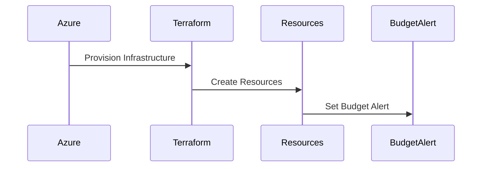

# Project : Terraform Azure Deployment with Budget Alert

This project uses Terraform to automate the deployment of resources on Azure, including setting up a budget alert to monitor and control Azure spending. It's designed to provide a simple and efficient way to manage and provision cloud infrastructure.

Creating this repository for IAC(Infrastructure as code) for provisioning of Azure services related to Azure Data Factory.

## Budget Alert

This project includes the setup of a budget alert on Azure. This alert will notify you when your Azure spending exceeds a certain threshold, helping you to monitor and control your costs.

## System Architecture

Please refer architecture.md

## Prerequisites

1. Azure account with subscription
2. Azure CLi authentication or Application Object authentication(preferred)
3. Terraform CLi
4. Any IDE

# Setup

Please follow Setup.md for more information

# Ignored Files

Please add the ignore files before initializing the terraform, else git can track terraform state and can included unnecessary large files. The .gitignore file includes:

- .config: Configuration files that may contain sensitive information.
- launch.json: VS Code configuration file for debugging settings.
- log.txt: Log files if any.
- \*.env: Environment files that may contain sensitive information.
- \*.pyc: Compiled Python files.
- \*.tfvars: Terraform variables file that may contain sensitive information.
- \*.tfstate : Terraform state files that may contain sensitive information.
- \*.out: Output files.
- \*.lock\*: Lock files.
- .terraform: Terraform directory that contains downloaded provider plugins and other temporary data.
- venv: Python virtual environment directory.

Happy Learning !
DataForgeMaster

### References:

CodeWithYu
