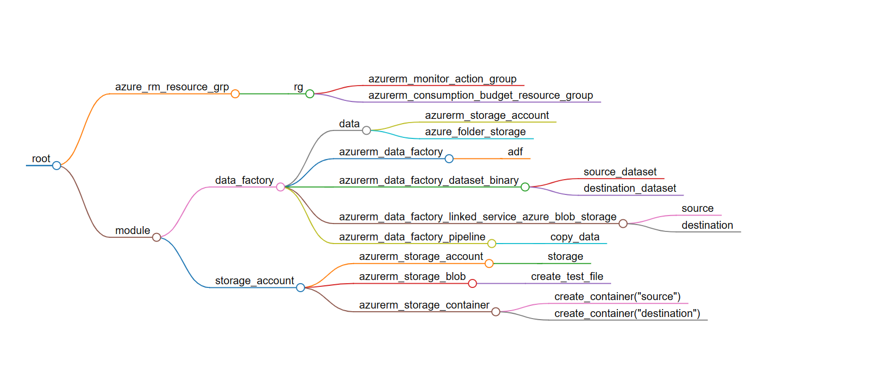

# Project Title: Terraform Azure Deployment with Budget Alert

This project uses Terraform to automate the deployment of resources on Azure, including setting up a budget alert to monitor and control Azure spending. It's designed to provide a simple and efficient way to manage and provision cloud infrastructure.

Creating this repository for IAC(Infrastructure as code) for provisioning of Azure services related to Azure Data Factory.

# Prerequisites

1. Azure account with subscription
2. Azure CLi authentication or Application Object authentication(preferred)
3. Terraform CLi
4. Any IDE

# Architecture

Please refer architecture.md

# Setup

Please follow Setup.md for more information

# ignored Files

The .gitignore file includes:

_.config: Configuration files that may contain sensitive information.
launch.json: VS Code configuration file for debugging settings.
log.txt: Log files.
_.env: Environment files that may contain sensitive information.
_.pyc: Compiled Python files.
_.tfvars: Terraform variables file that may contain sensitive information.
_.tfstate_: Terraform state files that may contain sensitive information.
_.out: Output files.
_.lock\*: Lock files.
.terraform: Terraform directory that contains downloaded provider plugins and other temporary data.
venv: Python virtual environment directory.
.idea: JetBrains IDE settings directory.

# Budget Alert

This project includes the setup of a budget alert on Azure. This alert will notify you when your Azure spending exceeds a certain threshold, helping you to monitor and control your costs.

Happy Learning !
DataForgeMaster

## References:

CodeWithYu
